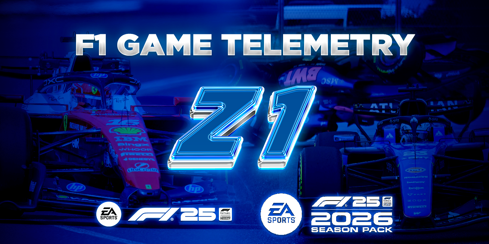
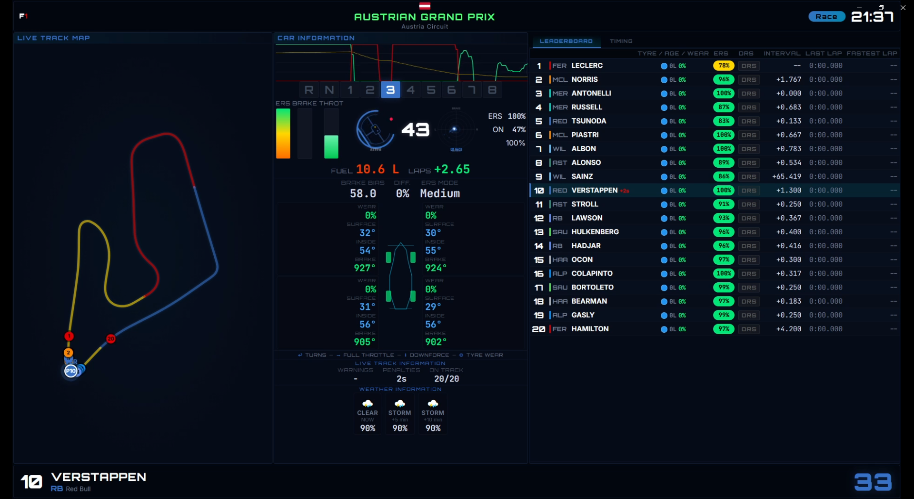
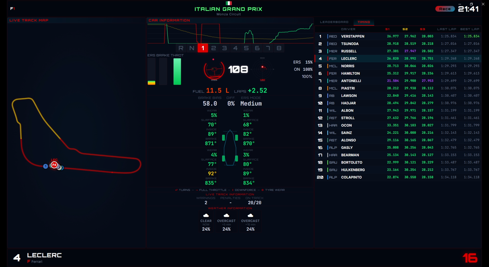

# 🏎️ Z1 - Formula 1 Game Telemetry Hub

<!-- Tech Stack Badges -->
      
<!-- Telemetry & F1 Badges -->
  

  

> 🌐 **Language ** 🇬🇧 **English**
> 
> 📖 A real-time, high-performance telemetry dashboard for **EA SPORTS F1 25 / F1 26**, inspired by the official Formula 1 TV broadcast graphics. 

---

## 📌 Overview & Architecture

**Z1** is a standalone Python application that intercepts UDP telemetry packets generated by the official F1 game and streams them via WebSockets to a sleek, dark-themed local web dashboard. Designed for Broadcast Engineers or sim-racing enthusiasts who want a professional pit-wall experience on a secondary monitor or mobile device.

The application is engineered to handle high-frequency data streams without blocking the user interface. It separates the heavy lifting into background threads while serving a lightweight, hardware-accelerated frontend.

**Tech Stack**

| Component | Technology |
| :--- | :--- |
| **Backend** | Python (Multithreading UDP Listener) |
| **Server** | Flask + Socket.IO (Real-time data streaming) |
| **Frontend** | HTML5 Canvas, CSS3, Vanilla JS |
| **Packaging** | Nuitka + Inno Setup (Standalone Windows executable) |

---

## 📊 Features & Displays

The dashboard accurately replicates the data a real race engineer would monitor:

* 🏆 **All Game Modes Supported:** Works seamlessly across all modes, including **Time Trial, Career, Grand Prix, and Online Multiplayer**.
* 🗺️ **Live Track Map:** Real-time positioning of all cars on the track, color-coded by team, with dynamic track loading.
* 📈 **Telemetry Traces:** Live rolling graphs for Speed, Throttle, and Brake inputs.
* 🏎️ **Car State:** Steering wheel rotation, G-Force radar, current Gear, ERS deployment, and DRS status.
*  ⚙️​ ​**Tyre & Damage Data:** Individual tyre wear percentages, core/surface temperatures, and brake temperatures.
* ⏱️ **Timing Tower:** Live sector times (Purple/Green/Yellow logic), interval gaps, and fastest lap tracking.
* 🌦️ **Live Weather:** Short-term forecast integration (current, +5 min, +10 min) with rain probability.

---

## 🖼️ Dashboard Preview

There are 2 different pages:

  

  

*The image shows the different graphic layouts and color.*

---

## 🚀 Quick Start (Installation)

You do not need to install Python or any dependencies to use Z1. The application is compiled into a lightweight, standalone Windows installer.

1. Go to the **[Releases](../../releases)** page on this repository.
2. Download the latest `Z1_Telemetry_Setup.exe` file.
3. Run the installer and extract the software to your PC.
4. Launch **Z1** from your Desktop or Start Menu.

---

## 🎮 Game Configuration

For the dashboard to receive data, you must enable telemetry output in the F1 game:

1. Open the game and go to **Settings > Telemetry**.
2. Set **UDP Telemetry** to `On`.
3. Set **UDP IP Address** to `127.0.0.1`.
4. Set **UDP Port** to `20777`.
5. Set **UDP Send Rate** to `30Hz` (or higher).
6. Set **UDP Format** to `2024` or `2025`.

---

## 📱 Mobile Access

Once the Z1 server is running, the desktop window will display a **QR Code**. Scan it with your smartphone or tablet (ensure both devices are connected to the same Wi-Fi network) to use your device as a secondary pit-wall display.

---

## 🗂️ Project Structure

For developers interested in compiling from source or modifying the dashboard. *(Note: The `app.dist` folder is intentionally excluded as it is generated during the build process).*

| Path | Description |
| :--- | :--- |
| `app.py` | Main entry point (GUI, Threads, Web Server) |
| `analyzer_Packets.py` | UDP packet parsing logic |
| `track_loader.py` | Track coordinates and geometry processing |
| `maps.py` | Dictionaries mapping IDs to F1 Teams, Tyres, etc. |
| `src/` | UI Source assets and icons |
| `static/` | Frontend Assets (CSS, JS) |
| `templates/` | Flask HTML Templates |
| `tracks/` | Text files containing track coordinate points |
| `InstallerSetupScript.iss` | Inno Setup compilation script |

---
## 🙌 Credits & Acknowledgments

This project wouldn't be possible without the resources and groundwork provided by the community and external services:

* 🏁 **EA SPORTS & Formula 1:** F1® 24, F1® 25, F1® 26 and related game assets/logos are trademarks of Electronic Arts Inc. and Formula One Digital Media Limited. *Note: This is an unofficial, community-driven tool and is strictly not affiliated with, nor endorsed by, EA SPORTS or Formula 1.*
* 🗺️ **Track Data:** The track coordinate files used for the live map drawing (`tracks/` directory) were sourced and adapted from [Fredrik2002's f1-25-telemetry-application](https://github.com/Fredrik2002/f1-25-telemetry-application). Huge thanks to them for their amazing work on extracting the track geometries!
* 🛡️ **Repository Assets:** Badges and aesthetic elements for this README were generated using [Shields.io](https://shields.io/) and [SimpleIcons](https://simpleicons.org).

---
## 📄 License

This project is licensed under the **Creative Commons Attribution-NonCommercial-NoDerivatives 4.0 International (CC BY-NC-ND 4.0)** license.

* **Attribution (BY):** You must give appropriate credit to Alessandro Zingaretti and provide a link to the license.
* **NonCommercial (NC):** You may not use the material for commercial purposes.
* **NoDerivatives (ND):** If you remix, transform, or build upon the material, you may not distribute the modified material.

---

## 📬 Contact

* 📧 `zingaale@gmail.com`
* 💼 [Alessandro Zingaretti](https://www.linkedin.com/in/alessandro-zingaretti)